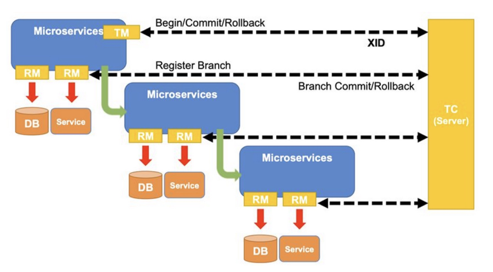

# Seata

## 1.1 Seata 简介

Seata 是一款开源的分布式事务框架。致力于在微服务架构下提高性能和简单易用的分布式事务服务。Seata 将为用户提供了 AT、TCC、SAGA 和 XA 事务模式，为用户打造一站式的分布式解决方案。

Seata 官网：https://seata.io/zh-cn/index.html

## 1.2 Seata 功能特色

1. 微服务框架支持

    目前支持 Dubbo、Spring Cloud、Sofa-RPC、Motan 和 grpc 等 RPC 框架。

2. AT 模式

    提供无侵入自动补偿的事务模式，目前支持 MySQL、Oracle、PostgreSQL 和 TiDB 的 AT 模式。是默认模式。

3. TCC 模式

    支持 TCC 模式，并可与 AT 混用，灵活度更高。

4. SAGA 模式

    为长事务提供有效的解决方案。

5. XA 模式

    支持已实现 XA 接口的数据库的 XA 模式。

6. 高可用

    支持基于数据库存储的集群模式，水平扩展能力强。

## 1.3 Seata 的三大角色

Seata 中有三大角色，分别是 TM、RM 和 TC。其中 TM 和 RM 是作为 Seata 的客户端与业务系统集成在一起，TC 作为 Seata 的服务端单独部署。

1. TC（Transaction Coordinator）事务协调者

    维护全局和分支事务的状态，驱动全局事务提交或回滚

2. TM（Transaction Manager）事务管理器

    定义全局事务范围：开始全局事务、提交或回滚全局事务

3. RM（Resource Manager）资源管理器

    管理分支事务处理的资源，与 TC 交谈以及注册分支事务和报告分支事务的状态，并驱动分支事务提交或回滚

在 Seata 中，一个分布式事务的生命周期：

1. TM 请求 TC 开启一个全局事务，TC 会生成一个 XID 作为该全局事务的编号，XID 会在微服务的调用链路中传播，保证将多个微服务的子事务关联在一起；
2. RM 请求 TC 将本地事务注册为全局事务的分支事务，通过全局事务的 XID 进行关联；
3. TM 请求 TC 通知 XID 所对应的全局事务进行提交/回滚
4. TC 驱动 RM 将 XID 对应的自身的本地事务进行提交/回滚

## Seata  AT 模式的设计思路

AT 模式是一种无侵入的分布式事务解决方案，在 AT 模式下，用户只关注自己的业务 SQL，用户的业务 SQL 作为第一阶段，Seata 框架会自动生成事务的第二阶段并进行提交或回滚的操作。

AT 模式的核心是对业务无侵入，是一种改进后的两阶段提交，其设计思路如下：

### 第一阶段

在第一阶段，Seata 会拦截业务 SQL，首先解析 SQL 语义，找到业务 SQL 要更新的业务数据，在业务数据被更新前，将其保存成 before imgae，然后执行业务 SQL 来更新业务数据，在业务数据更新之后，在将其保存成 after image，最后生成行锁。以上操作全部在一个数据库事务内完成，这样保证了一段操作的原子性。

参考官方文档： https://seata.io/zh-cn/docs/dev/mode/at-mode.html

### 第二阶段

- 若所有分支事务都操作成功，即业务 SQL 在第一阶段已经提交至数据库，所以 Seata 框架只需要异步的将第一阶段保存的快照数据和行锁删掉，完成数据清理即可。

    

- 若存在分支事务操作失败，则 Seata 框架就需要回滚第一阶段已经执行的业务 SQL，还原业务数据。回滚的方式便是通过 before image 还原业务数据，但在还原之前要首先检验脏写，对比数据库当前业务数据和 after image，

    - 如果两份数据完全一致，就说明没有脏写，可以还原业务数据，并删除 undolog
    - 如果两份数据不一致，就说明存在脏写，此时就需要转人工处理。
    
    

### 二阶段的整体执行流程

AT 模式的一阶段、二阶段提交和回滚均由 Seata 框架自动完成，用户只需要编写业务 SQL，便能轻松接入分布式事务，AT 模式是一种对业务无任何侵入的分布式事务解决方案。

### 写隔离

- 一阶段本地事务提交前，需要确保先拿到**全局锁**
- 若无法获取到全局锁，则不能提交本地事务
- 获取全局锁的尝试被限制在一定范围内，超出范围将放弃，并回滚本地事务，释放本地锁

### 设计亮点

Seata 架构的设计亮点：

1. 应用层基于 SQL 解析，实现了自动补偿，从而最大程度的降低业务侵入性；
2. 将分布式事务中的 TC（事务协调者）独立部署，负责事务的注册、回滚；
3. 通过全局（行）锁实现了写隔离与读隔离。

### 存在的问题

#### 性能损耗

对数据库的一个写操作，需要执行以下操作

1. 则需要全局事务 XID 获取（与 TC 通讯）；
2. Before image（解析 SQL，查询一次数据库）；
3. After image（查询一次数据库）；
4. insert undolog（写一次数据库）；
5. Before commit（与 TC 通讯，判断锁冲突）

这些操作都需要一次远程 RPC 通讯，而且是同步的。另外 undolog 写入的时候 blob 字段的插入性能也是不高的，每条写 SQL 都会增加这么多开销。

#### 全局锁

1. 热点数据

    相比 XA，Seata 虽然在一阶段成功后会释放数据库锁，但一阶段在 commit 前，全局行锁的判断也拉长了对数据锁的占有时间。全局锁的引入实现了隔离性，但带来的问题就是阻塞，降低并发性，尤其是热点数据，这个问题会更加严重。

2. 回滚锁释放时间

    Seata 在回滚时，需要先删除各节点的 undolog，然后才能释放 TC 内存中的锁，所以，如果第二阶段是回滚，释放锁的时间会更长。

3. 死锁问题

    Seata 的引入全局锁会额外增加死锁的风险，但如果出现死锁，会不断进行重试，最后靠等待全局锁超时，这种方式并不优雅，也延长了对数据库锁的占有时间。
